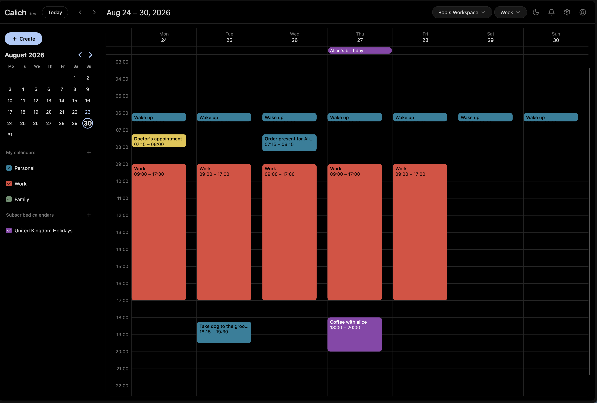
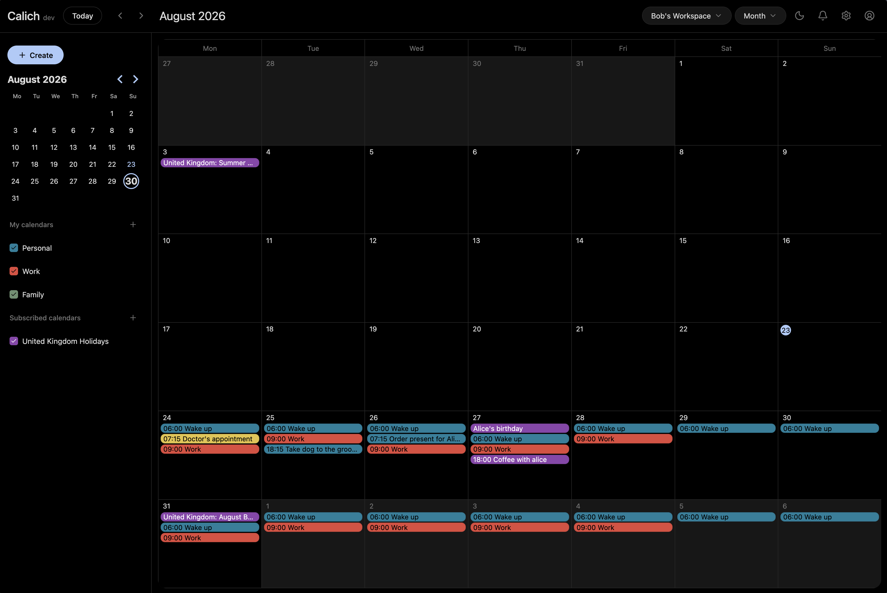
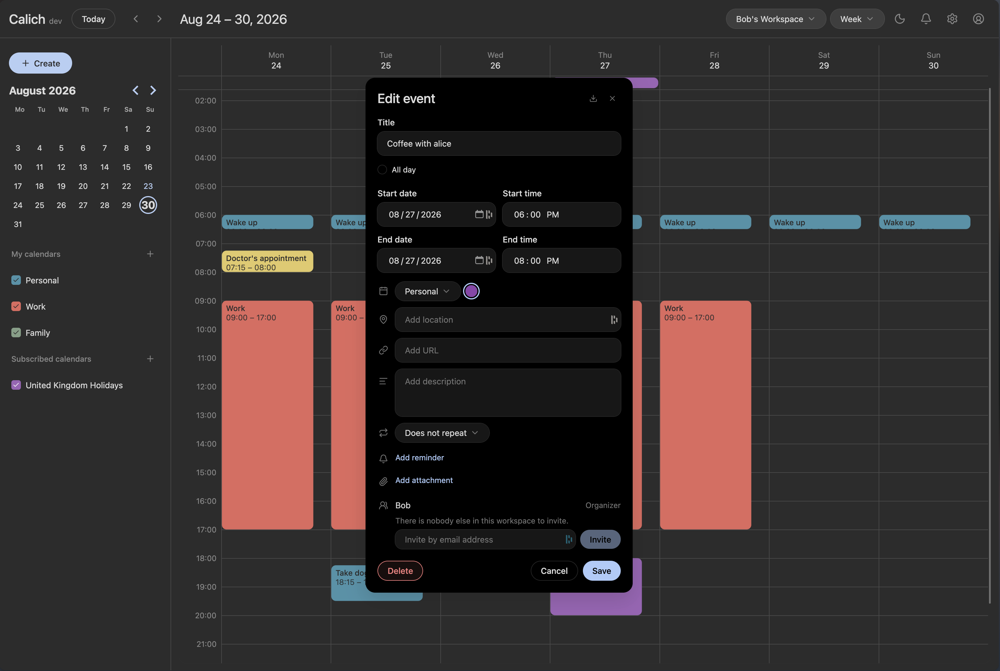
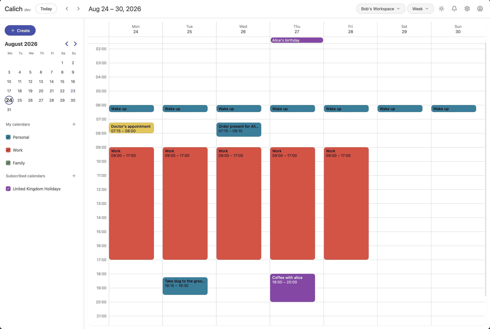
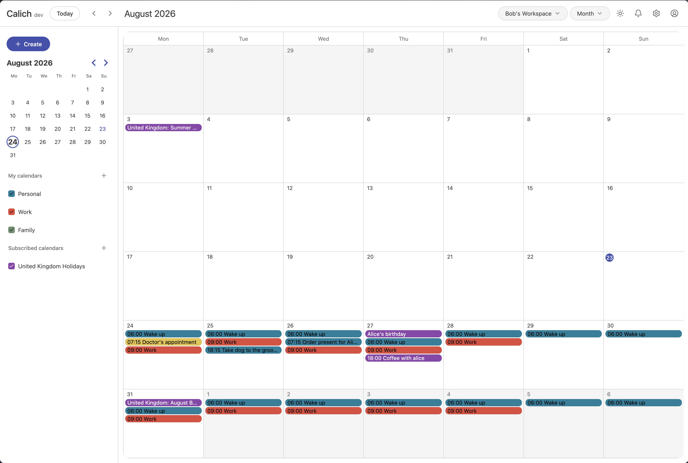
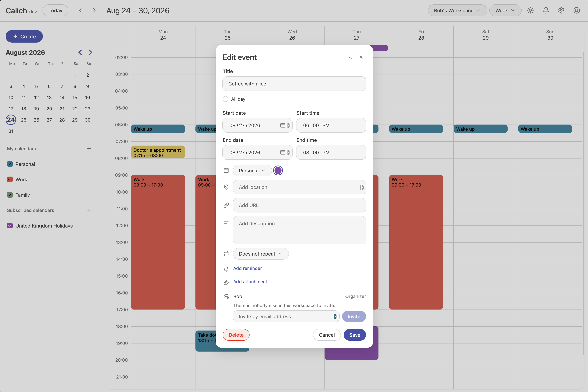

# Calich

An open-source, self-hosted Google Calendar alternative with **CalDAV** sync.

## Table of contents

- [Screenshots](#screenshots)
- [Deployment](#deployment)
  - [Docker](#docker)
  - [Pre-compiled binaries](#pre-compiled-binaries)
  - [Building from source](#building-from-source)
- [CalDAV sync](#caldav-sync)
- [Configuration](#configuration)
  - [`COOKIE_SECURE`](#cookie_secure)
  - [Behind a reverse proxy](#behind-a-reverse-proxy)
  - [Connecting a Google account](#connecting-a-google-account)
- [Data & backups](#data--backups)
- [Roadmap](#roadmap)

**Current features**

- **Day, Week, Month and Year views**, with drag-to-create, drag-to-move and resize.
- **Recurring events and all-day events**
- **CalDAV**: two-way sync with your phone and other calendar apps.
- **Workspaces**: share calendars with other members, organize members into groups,
  and invite people by email.
- **Attendees and invitations** — Invite others to events.
- **Reminders**: in-app and email.
- **Attachments**
- **Subscribed calendars**: subscribe to any `.ics` URL.
- **Import and export** of `.ics` and `.zip` files.
- **Light and dark themes**, 12/24-hour time, and a configurable week start.

## Screenshots

<details>
<summary><b>Dark mode</b></summary>

<br>





</details>

<details>
<summary><b>Light mode</b></summary>

<br>





</details>

## Deployment

Calich is a single binary serving both the API and the web app on one port
(`8080` by default). All persistent data live under one directory, so a
deployment is the binary (or container) plus a volume.

### Docker

The quickest way to get an instance running:

```bash
docker run -d \
  --name calich \
  -p 8080:8080 \
  -v /srv/calich/data:/data \

  -e INITIAL_EMAIL=you@example.com \ # Optional
  -e INITIAL_PASSWORD=change-me \ # Optional
  -e INITIAL_NAME=change-me \ # Optional
  -e COOKIE_SECURE=false \ # false by default, set to true when running behind a reverse proxy

  xiovv/calich:latest
```

Or with Compose:

```yaml
services:
  calich:
    image: xiovv/calich:latest
    container_name: calich
    restart: unless-stopped
    ports:
      - "8080:8080"
    volumes:
      - ./data:/data
    environment:
      INITIAL_EMAIL: you@example.com # Optional
      INITIAL_PASSWORD: change-me # Optional
      INITIAL_NAME: change-me  # Optional
      COOKIE_SECURE: false # false by default, set to true when running behind a reverse proxy
```

```bash
docker compose up -d
```

`INITIAL_EMAIL`, `INITIAL_PASSWORD` and `INITIAL_NAME` create the first account on first start, and
are ignored on every start afterward. They're optional: if you leave them out you
will be redirected to the sign up page automatically to create your account.

To build the image yourself instead of pulling it:

```bash
make docker-build          # or: docker build -t calich-server .
make docker-run            # runs it on :8080, mounting ./data
```

### Pre-compiled binaries

Grab the archive for your platform from the
[Releases page](https://github.com/XiovV/calich/releases), unpack it, and run it:

```bash
tar -xzf calich_linux_amd64.tar.gz
sudo install calich-server /usr/local/bin/

sudo mkdir -p /var/lib/calich
DATA_DIR=/var/lib/calich \
INITIAL_EMAIL=you@example.com \
INITIAL_PASSWORD=change-me \
  calich-server
```

To run it as a service, a minimal systemd unit:

```ini
# /etc/systemd/system/calich.service
[Unit]
Description=Calich calendar server
After=network.target

[Service]
User=calich
Environment=DATA_DIR=/var/lib/calich
Environment=PORT=8080
ExecStart=/usr/local/bin/calich-server
Restart=on-failure

[Install]
WantedBy=multi-user.target
```

```bash
sudo systemctl enable --now calich
```

### Building from source

You'll need **Go 1.26+**, **Node 22+** and **Yarn**.

```bash
git clone https://github.com/XiovV/calich.git
cd calich

# 1. Build the web app
yarn install --frozen-lockfile
make build-frontend                       # writes ./dist

# 2. Embed it in the server and compile
cp -r dist/. server/internal/static/dist/
make build-backend VERSION=v1.0.0         # writes server/bin/calich-server
```

`VERSION` is optional. If left unset, the version badge will show `dev`.

Then run it:

```bash
DATA_DIR=/var/lib/calich \
INITIAL_EMAIL=you@example.com \
INITIAL_PASSWORD=change-me \
  ./server/bin/calich-server
```

For development, run the two halves separately instead — `make dev-backend` on
`:8080` and `make dev-frontend` for the Vite dev server, which proxies `/api` to it.
`make help` lists every target.

## CalDAV sync

Calich syncs two-way with any CalDAV-capable calendar app (iOS/macOS Calendar,
Thunderbird, DAVx5, etc.).

1. In Calich, go to **Settings → App passwords**.
2. Give it a label (e.g. `Phone`) and click **Generate**.
3. Copy the password shown — it's only displayed once.
4. In your calendar app, add a CalDAV account using:
   - **Server/URL**: the domain your Calich instance runs at
   - **Username**: your Calich account email
   - **Password**: the app password you just generated

Each app password can be revoked independently without affecting your login or
other devices.

## Configuration

All configuration is by environment variable.

| Variable                                                            | Default             | What it does                                                                                                                                                                     |
| ------------------------------------------------------------------- | ------------------- | -------------------------------------------------------------------------------------------------------------------------------------------------------------------------------- |
| `PORT`                                                              | `8080`              | Port the server listens on.                                                                                                                                                      |
| `DATA_DIR`                                                          | `/data`             | Directory holding all persistent state.                                                                                                                                          |
| `INITIAL_EMAIL`                                                     | —                   | Login identifier for the bootstrap account, created on first start if no account exists.                                                                                         |
| `INITIAL_PASSWORD`                                                  | —                   | Password for that account. Set it and `INITIAL_EMAIL` together, or omit both and register through the first-run form.                                                            |
| `INITIAL_NAME`                                                      | `Admin`             | Display name for that account.                                                                                                                                                   |
| `ENABLE_SIGNUPS`                                                    | `false`             | Allow self-registration. The first account is always creatable regardless.                                                                                                       |
| `COOKIE_SECURE`                                                     | `false`             | Whether the refresh-token cookie is marked `Secure`. Defaults off so a plain-HTTP LAN deployment works out of the box. **Set it to `true` whenever TLS is in front.** See below. |
| `MAX_ATTACHMENT_SIZE`                                               | `26214400` (25 MiB) | Largest single attachment accepted, in bytes.                                                                                                                                    |
| `MAX_ATTACHMENTS_PER_EVENT`                                         | `10`                | How many attachments one event may carry.                                                                                                                                        |
| `SUBSCRIPTION_REFRESH_INTERVAL`                                     | `1h`                | Poll cadence for a subscribed calendar whose feed states none of its own. Go duration syntax.                                                                                    |
| `INVITE_RATE_LIMIT_PER_HOUR`                                        | `100`               | Per-user hourly ceiling on queued invitations.                                                                                                                                   |
| `AUTH_RATE_LIMIT_PER_EMAIL`                                         | `10`                | Failed sign-in attempts per email per 15 minutes, across login and CalDAV.                                                                                                       |
| `AUTH_RATE_LIMIT_PER_IP`                                            | `30`                | Failed sign-in attempts per IP per 15 minutes.                                                                                                                                   |
| `REGISTER_RATE_LIMIT_PER_IP`                                        | `20`                | Registration attempts per IP per hour.                                                                                                                                           |
| `SMTP_HOST` / `SMTP_PORT` / `SMTP_USER` / `SMTP_PASS` / `SMTP_FROM` | —                   | Outbound mail. Email reminders and invitations are only offered when **all five** are set.                                                                                       |
| `IMAP_HOST` / `IMAP_PORT` / `IMAP_USER` / `IMAP_PASS`               | —                   | The mailbox `SMTP_FROM` sends from, polled for invitation replies. Without it, invitations still send but no response ever comes back.                                           |
| `GOOGLE_CLIENT_ID` / `GOOGLE_CLIENT_SECRET`                         | —                   | Your own Google OAuth client. Connecting a Google account is only offered when both, and `CONNECTIONS_ENCRYPTION_KEY`, are set. See below.                                       |
| `CONNECTIONS_ENCRYPTION_KEY`                                        | —                   | Encrypts a connected account's refresh token at rest. Losing it costs re-authorization, not data — it isn't stored anywhere Calich manages, so back it up yourself. See below.    |

### `COOKIE_SECURE`

Leave it `false` if you reach Calich over plain HTTP, such as a LAN address like
`http://192.168.1.50:8080` — browsers discard a `Secure` cookie sent from a
non-HTTPS origin, so switching it on there makes logins silently fail to stick.
Set it to `true` as soon as anything terminates TLS in front of Calich, otherwise
the refresh token can leak over a plaintext request to your host. If Calich sees a
request arrive over TLS while the setting is still off, it logs a warning telling
you to flip it.

### Behind a reverse proxy

Once you're terminating TLS, set `COOKIE_SECURE=true` alongside it:

```yaml
services:
  calich:
    image: xiovv/calich:latest
    restart: unless-stopped
    volumes:
      - ./data:/data
    environment:
      COOKIE_SECURE: "true" # required once TLS is in front
    expose:
      - "8080"
```

A minimal Caddy site block, which handles certificates automatically:

```caddyfile
calich.example.com {
    reverse_proxy calich:8080
}
```

Or nginx:

```nginx
server {
    listen 443 ssl;
    server_name calich.example.com;

    ssl_certificate     /etc/letsencrypt/live/calich.example.com/fullchain.pem;
    ssl_certificate_key /etc/letsencrypt/live/calich.example.com/privkey.pem;

    location / {
        proxy_pass http://calich:8080;
        proxy_set_header Host              $host;
        proxy_set_header X-Real-IP         $remote_addr;
        proxy_set_header X-Forwarded-For   $proxy_add_x_forwarded_for;
        proxy_set_header X-Forwarded-Proto $scheme;
    }
}
```

### Connecting a Google account

Calich ships no Google client of its own — each instance uses its own, so a
compromised or disabled credential never takes down every self-hosted instance
at once. Without one, Connections is simply absent from Settings; nobody sees
a button that can't work.

1. In the [Google Cloud Console](https://console.cloud.google.com/), create a
   project and enable the **Google Calendar API**.
2. Under **APIs & Services → Credentials**, create an **OAuth client ID** of
   type **Web application**. Add your instance's own origin as an authorized
   redirect URI, followed by `/api/connections/google/callback` — e.g.
   `https://calendar.example.com/api/connections/google/callback`. This must
   match exactly, including scheme and port.
3. Set `GOOGLE_CLIENT_ID` and `GOOGLE_CLIENT_SECRET` from that client.
4. Set `CONNECTIONS_ENCRYPTION_KEY` to a long random string — it's what
   encrypts a connected account's refresh token before it's stored. Keep it
   secret and keep a copy somewhere other than `DATA_DIR`: losing it means
   every Connection has to be re-authorized, not that any data is lost.

**Your project starts in "Testing" status, and that matters.** A Google Cloud
project left in Testing issues refresh tokens that **expire after 7 days** —
a Connection will quietly stop syncing every week. This is not a bug in
Calich. Once you're happy it works, flip your project to **In production**
in the OAuth consent screen settings. You'll still see Google's "unverified
app" warning when connecting — that's expected too, and permanent under this
per-instance-credential model — but your users' Connections will stop
expiring on a timer.

## Data & backups

Everything this instance keeps is under `DATA_DIR` (default `/data`): `calich.db`
(SQLite) and an `attachments/` directory holding every uploaded file's bytes.

## Roadmap

- [ ] Keyboard shortcuts
- [ ] Connect with Google Calendar
- [ ] Agenda view and daily agenda reminders
- [ ] Tasks integration
- [ ] Booking pages
- [ ] Mobile app
